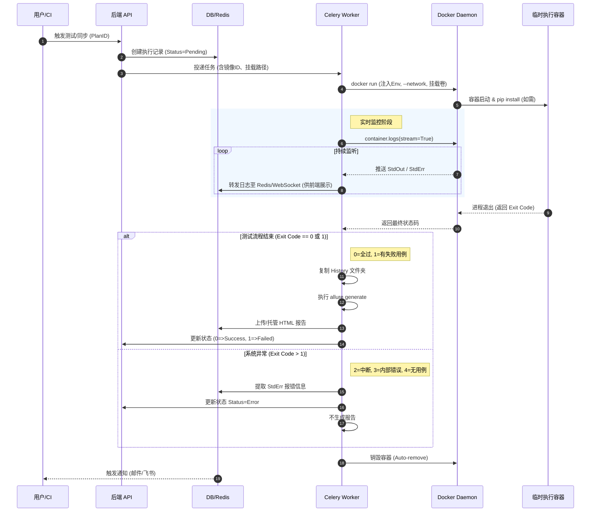

# 自动化测试平台 (ATP) 产品需求文档

## 1. 文档控制 (Document Control)

| 版本号 | 日期       | 修改人 | 修改描述               | -   |
| :----- | :--------- | :----- | :--------------------- | :-- |
| v0.1.0 | 2026-01-05 | ycb    | 初始草案，定义核心架构 | -   |

---

## 2. 项目背景与目标 (Background & Objectives)

### 2.1 现状痛点

- 自动化用例 编写成本高
- 自动化用例 维护成本高
- 自动化用例 覆盖率不足

### 2.2 业务目标

- **核心指标 (KPIs)**: 回归测试时间缩短 x%，测试覆盖率提升至 x%。
- **交付物**: 统一的 Web 管理控制台、分布式执行节点、可视化报告服务。

### 2.3 范围界定 (Scope)

- **In-Scope**: 接口自动化 (API)、API 接口覆盖率、定时任务调度。
- **Out-of-Scope**:
  - 性能压测 (后期迭代)、单元测试管理。
  - **AI 辅助模块**: 包含 RAG 用例生成、根因分析 (RCA)、自然语言转 SQL。此类功能将在 v0.3+ 版本以“插件”形式引入。

---

## 3. 总体架构设计 (System Architecture)

### 3.1 技术栈 (Tech Stack)

<!-- v0.1.0 阶段建议采用单机部署，或通过 NFS/S3 解决跨节点文件访问问题 -->

- **Backend**: Python (FastAPI/Django) + Celery (异步任务)
- **Frontend**: Vue3 / React
- **Database**: PostgreSQL (元数据) + Redis (缓存/消息队列) + 本地文件系统 (Local Volume)
- **Execution**: Docker API 临时容器

### 3.2 逻辑架构图

_(建议插入 Mermaid 或架构图图片)_

### 3.3 插件化架构与扩展性 (Plugin Architecture)

本平台采用“核心+插件”模式，为未来 AI 介入预留 Hook (钩子)，但不强依赖 AI。

- **Core**: 任务调度、容器管理、报告生成 (必须 100% 稳定)。
- **Extensions (预留)**:
  - **Webhook Notifier**: 允许将失败日志 JSON 推送到外部服务 (为未来的 AI 分析服务做准备)。
  - **Data Export**: 支持导出清洗后的测试数据 (为未来的 RAG 向量库构建做准备)。

---

## 4. 核心功能模块 (Functional Requirements)

### 4.0 用户认证 (Authentication)

#### 登录方式:

- 基础模式 (MVP): 支持 账号/邮箱 + 密码 登录。
- 企业集成 (v0.2+): 预留 LDAP/OIDC 接口，支持通过 GitLab/飞书/企业微信 扫码单点登录 (SSO)。

#### 会话管理:

- 采用 双 Token 机制 (Access Token + Refresh Token) 以兼顾安全与体验。
- Access Token: 有效期 30 分钟，用于 API 请求。
- Refresh Token: 有效期 7 天，用于在前端静默刷新 Access Token，避免用户频繁登出。

#### 初次初始化:

- 系统启动时若检测到无用户，自动创建一个默认超级管理员 (admin/admin)。

### 4.1 用例同步 (Git-Based Sync)

- 执行机制: 将“同步用例”视为一种特殊的执行任务。
- 隔离解析: 启动包含项目环境的临时容器，运行 pytest --collect-only --json-report。
- 数据清洗: 读取容器生成的 JSON 文件，提取 nodeid, docstring, markers，更新至 TestCase 表。

### 4.2 配置中心 (Configuration)

- 环境隔离: 定义 Dev/Test/Prod 的 BaseURL 和 DB 连接串。
- 变量管理: 提供加密的 Key-Value 存储 (API Key, Secrets)，运行时注入到容器环境变量中。
- 场景化测试支持 (Scenario Support):
  - Session 管理: 推荐使用 Pytest Fixture 封装 requests.Session，实现 Cookie/Token 的自动流转。
  - 上下文传递: 支持在单测试函数内通过局部变量传递 order_id 等关键参数。
  - 步骤可视化: 强制要求场景测试代码集成 allure.step，以便在报告中展示业务链路的每一步执行情况。
- 环境安全策略 (Environment Safety Policy):
  - 变量分级: 将配置项分为 Safe (如 URL) 和 Sensitive (如 DB Password)。
  - 环境锁 (Environment Lock):
    - 针对 Production 环境，系统强制开启 "Read-Only Mode"。
    - 在此模式下，若检测到用例包含 POST/PUT/DELETE 请求或 SQL INSERT/UPDATE 语句，执行引擎将直接拒绝执行并报警。
    - 例外: 只有拥有 Super Admin 权限且在用例上打上 force_run_in_prod 标签的任务才可绕过。

### 4.3 任务执行 (Execution)

- One-Task-One-Container: 每次执行启动独立的 Docker 容器，杜绝环境污染。
- 资源限制: 启动时通过 Docker API 注入 mem_limit="512m" 和 cpu_period 防止资源耗尽。
- 网络策略: 容器需配置 --network 参数以确保能访问被测服务 (如 host.docker.internal 访问宿主机服务)。
  - 针对 Linux Server
    - 在 docker run 命令中显示添加参数: --add-host host.docker.internal:host-gateway (适用于 Docker v20.10+)。
    - 或者对于内网环境，直接允许使用 --network host 模式（虽然安全性稍低，但对 MVP 最省事）。

### 4.4 报告增强 (Reporting)

- 挂载卷 (Volume Mounting): 必须强制规定，所有执行容器启动时，必须挂载宿主机的临时目录 -v /host/temp/{report_id}:/app/report。
- 生成流程: 容器内生成结果到挂载目录 -> 容器销毁 -> Celery Worker 读取宿主机目录 -> 调用 Allure CLI 生成 HTML -> 上传/托管。
- 历史趋势集成: 在生成报告前，系统自动从对象存储/本地历史中检索该 Project 上一次报告的 history 文件夹，并复制到本次结果目录，以确保 Trend 图表连续。
- 接口覆盖率计算: - 系统支持录入 Swagger JSON 地址。 - 每次测试结束后，自动比对 Pytest Collected Items 中的 URL 与 Swagger 列表。 - 输出 "未覆盖接口清单 (Uncovered Endpoints)"，帮助测试人员发现盲区。
<!-- 数据库 test_execution_steps 表需预留 analysis_result (JSON) 字段，用于存储未来 AI 分析产生的建议文本，默认值为空 -->

### 4.5 资源清理 (Teardown Policy)

#### 数据闭环与清理:

- Fixtures 机制: 推广使用 Pytest 的 yield 机制。
  - Setup: 创建数据 -> 记录 ID。
  - Teardown: 无论测试成功失败，通过 ID 删除数据。
- 垃圾回收兜底: 针对 Teardown 失败的情况，平台提供“数据前缀扫描器”，定期清理生产/预发布环境中带有 AT\_ (Automation Test) 前缀的脏数据。

### 4.6 AI 辅助组件 (AI Copilot Extensions)

(标注: v0.1.1 迭代特性，低优先级，仅依赖外部 API)

- 智能报错分析 (Error Insight):
  - 前端: 在报告详情页增加“AI 分析”按钮。
  - 后端: 增加 /api/v1/ai/analyze 接口，对接 DeepSeek/OpenAI。
  - 逻辑: 仅在用户点击时触发（On-Demand），不阻塞自动执行流程，不增加数据库负担。

---

## 5. 核心业务流程与数据流图 (Data Flow)

### 5.1 用例执行时序图 (Mermaid)



### 5.2 状态机流转 (Status Lifecycle)

Pending (排队中) -> Running (执行中) -> Success/Failed/Error (完成) -> Aborted (人工终止)

Pending -> Running -> Skipped

Pending -> Running -> Error

## 6. API 契约与规范 (API Specifications)

### 6.1 设计原则

RESTful 风格，版本号 /api/v1/。
认证方式: Bearer Token (JWT)。

### 6.2 关键接口定义 (示例)

#### 6.2.0 认证模块 (Auth)

- 登录 (Login)

  - Endpoint: POST /api/v1/auth/login
  - Request: Content-Type: application/x-www-form-urlencoded (遵循 OAuth2 规范)
    ```JSON
        { "username": "admin", "password": "encrypted_sha256_string" }
    ```
  - Response:

    ```JSON
        {
    "access_token": "eyJhb...",
    "refresh_token": "dji39...",
    "token_type": "bearer",
    "user": { "id": 1, "role": "admin", "nickname": "Super Admin" }
    }
    ```

- 刷新令牌 (Refresh Token)
  - Endpoint: POST /api/v1/auth/refresh
  - Headers: Authorization: Bearer {refresh_token}
  - Response: 返回新的 access_token。
- 获取当前用户信息 (Me)
  - Endpoint: GET /api/v1/auth/me
  - Purpose: 前端页面刷新后，通过此接口确认 Token 是否有效以及获取用户权限列表。

#### 6.2.1 执行测试计划

Endpoint: POST /api/v1/executions/
Request Body:

```JSON
{
  "plan_id": 1024,
  "environment": "stage",
  "trigger_source": "jenkins_pipeline_#55"
}
```

Response:

```JSON
{
  "code": 200,
  "data": { "report_id": "r-20260105-xq92" },
  "msg": "Task dispatched"
}
```

#### 6.2.2 获取报告详情

Endpoint: GET /api/v1/reports/{report_id}/
Response: 包含汇总数据、用例列表详情链接。

## 7. 非功能需求 (Non-functional Requirements)

### 7.1 性能要求 (Performance)

并发能力: 单个 Worker 节点需支持至少 50 个并发 API 请求或 5 个并发 UI Session。
响应时间: 报告页面加载需在 2 秒内完成 (需对历史数据分表或归档)。

### 7.2 安全性 (Security)

敏感数据: 密码、Token 等敏感配置必须 AES-256 加密存储。
操作审计: 关键操作 (删除用例、修改配置) 需记录 Audit Log。
密码存储安全:
存储策略: 严禁明文存储密码。后端数据库仅存储加盐哈希值。
算法: BCrypt 或 Argon2 (目前最推荐)。
实现: Python 中使用 passlib[bcrypt] 库
前后端交互安全:
传输加密: 强制 HTTPS。
防暴力破解: 登录接口限制速率 (Rate Limiting)，例如同一 IP 1 分钟内只能尝试 5 次，超过锁定 10 分钟 (利用 Redis 实现)。

### 7.3 可靠性与容错 (Reliability)

任务重试: 网络抖动导致的失败支持自动重试 (Retry Mechanism)。
超时控制: 单个用例执行超时强制 Kill，防止阻塞队列。

### 7.4 依赖管理 (Dependency Management):

Pre-built Image (预构建镜像)

- 提供一个 Dockerfile 模板
- 如果 requirements.txt 变更，用户需先触发“构建镜像”动作 (Docker build)
- 测试执行时，直接 docker run {project_image}，实现秒级启动
- 锁机制: 当项目处于 Building 状态时，前端禁用“执行”按钮，或后端将任务强制排队 (Pending)，直到构建完成

### 7.5 僵尸进程清理:

如果测试脚本死循环，Worker 必须有硬性的 soft_time_limit 和 hard_time_limit (Celery 自带配置)，并在超时后强制 kill -9 容器。

### 7.6 日志处理:

流式读取: Celery Worker 不应等待容器结束才读取日志，应通过 container.logs(stream=True) 实时捕获标准输出 (StdOut) 并推送到 WebSocket/Redis，实现前端“像看终端一样”看日志。

### 7.7 垃圾回收

Cron Job: 系统需自带定时任务，每天凌晨清理 Created_Time 早于 30 天前的文件 (Delete files older than 30 days)和中间结果 (allure-results)，仅保留最终生成的 HTML。

## 8. 产品演进路线图 (Roadmap)

### Phase 1: 基础设施 (v0.1.0 - 本次交付)

- 目标: 跑通 Git -> Docker -> Allure 的全流程。
- 关键点: 确保数据（日志、报错堆栈、HTML）被完整、结构化地保存下来。**没有数据就没有 AI。**

### Phase 2: 稳定性与易用性 (v0.2.0)

- 目标: 增加 Dashboard 统计图表，优化调度算法。

### Phase 3: AI 辅助插件 (v0.3.0+)

- **Copilot Plugin**: 读取 Phase 1 积累的历史报错数据，通过 LLM 给出修复建议。
- **Magic Generator**: 基于 Phase 1 积累的 API 调用链，自动组合生成新用例。
- **定位**: AI 功能将以 "Beta" 标签上线，允许用户在设置中一键关闭。
